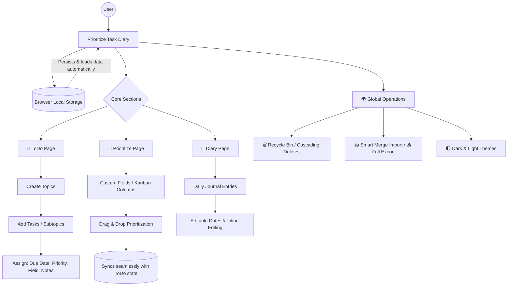

# Prioritize Task Diary

A comprehensive, client-side personal productivity application that combines a hierarchical ToDo list, a priority-based Kanban board, and a daily diary. All your data is stored locally in your browser, ensuring privacy and speed.

## 🧠 How It Works (Application Architecture)

## ✨ Features

### 📝 ToDo Page
- **Hierarchical Structure:** Organize your tasks under different **Topics**.
- **Topic Management:** Create, delete, and rename topics with a simple click. Assign priority numbers to your topics to control their order.
- **Task Management:** Add, edit, and delete subtasks (tasks) within each topic.
- **Rich Task Details:** Assign a due date, a priority level (P1-P5), and a 'Field' to each task.
- **Intuitive Reordering:** Use drag-and-drop (⋮⋮) to reorder tasks within a topic, move them to a completely different topic, or assign them to a different field.
- **Flexible Sorting:** Sort topics and tasks by Name (A-Z), Date, or Priority (P1-P5).

### 🚀 Prioritize Page (Kanban Board)
- **Visual Workflow:** Visualize your tasks across customizable vertical columns called **Fields** (e.g., "Work", "Personal", "Urgent").
- **Field Management:** Create, rename, delete, and assign priority numbers to fields. Each field automatically gets a distinct color badge.
- **Direct Task Editing:** Update a task's Topic, Field, or Priority level directly from the Kanban board using the convenient inline dropdowns.
- **On-the-fly Topic Creation:** Select "+ New Topic" from any task's dropdown to instantly create and assign a new topic without leaving the view.
- **Task Prioritization:** Drag-and-drop tasks vertically within a column to set their priority number automatically.
- **Seamless Task Movement:** Move tasks between different fields with a simple drag-and-drop action.
- **Inline Task Creation:** Quickly add new tasks directly into any specific field column.
- **Dynamic Sorting:** Sort tasks within each column by Priority Number (1+), Priority Rating (P1-P5), or Name.

### 📓 Rich Task Notes
- **Detailed Tracking:** Click the note icon (🗒️) on any task to open a spacious, dedicated notes editor.
- **Rich Text & Links:** The editor supports rich text pasting and automatically turns typed URLs into clickable links.
- **Quick Status Emojis:** Use the built-in emoji toolbar to quickly insert common status markers (✅ Done, ❌ Cancelled, ⌛ Waiting, 📅 Postponed) exactly where your cursor is.

### 📖 Diary Page
- **Daily Journaling:** Create and save diary entries for any date.
- **Inline Editing:** Click directly on an entry's text to seamlessly edit its content inline.
- **Editable Dates:** Easily change the date of any past entry using the integrated date picker, and your entries will automatically re-sort.
- **Chronological Sorting:** Sort your entries by Date Descending (Newest First) or Date Ascending (Oldest First).

### 🌍 Global Features & Data Security
- **Click-to-Edit:** Simply click on the text of any Topic, Task, Field, or Diary entry to edit it instantly.
- **Dark & Light Modes:** Switch between themes for comfortable viewing day or night.
- **Recycle Bin (Safe Delete):** Deleted items (Topics, Tasks, Fields, Diary Entries) are moved to a recycle bin, preventing accidental data loss. 
  - *Cascading Deletes:* Deleting a Prioritize Field sends all of its assigned tasks to the recycle bin along with it. Restoring the field seamlessly restores all its tasks back to their original topics.
- **Data Portability:**
    - **Smart Merge Import:** Restore your data from a backup file. The system intelligently *merges* the imported data with your current workspace (adding missing topics, tasks, and diary entries) instead of wiping out your existing data.
    - **Full Export:** Download a complete backup of all your data (including the recycle bin) as a single JSON file.
- **Persistent State:** Your data is automatically saved to your browser's `localStorage`, so everything is just as you left it when you return.
- **Fully Responsive:** The layout is designed to work on various screen sizes.

## 🚀 How to Use

This is a pure client-side application. No build process, dependencies, or server is required.

1.  Clone or download this repository.
2.  Open the `index.html` file in your favorite modern web browser (like Chrome, Firefox, or Edge).
3.  That's it! Start organizing your life.

## 🛠️ Technology Stack
-   **HTML5** (Semantic structure, native Dialogs)
-   **CSS3** (CSS Variables, Flexbox, smooth transitions)
-   **Vanilla JavaScript (ES6+)** (No external frameworks like React or Vue)